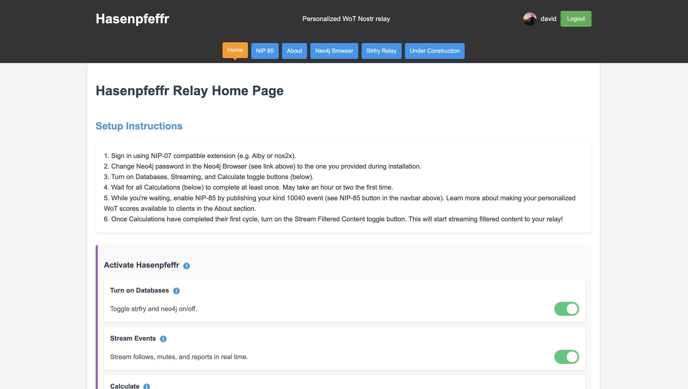

# Hasenpfeffr

Hasenpfeffr is a _Personalized Webs of Trust Nostr relay_ that uses advanced techniques to calculate personalized webs of trust, resulting in high-quality, spam-free nostr content, curated by _your_ Nostr community.

## Why use Hasenpfeffr?

- You and your friends can use your hasenpfeffr relay as a normal Nostr content relay, with spam and other unwanted content removed using state of the art WoT technology
- Export personalized WoT scores as NIP-85 Trusted Assertions (kind 30382 events), ready for usage by all NIP-85-compliant clients



## Features

- ✅ stream content filtered by your customizable and auto-generated whitelist
- ✅ personalized WoT scores calculated every 6 hours, including:
  - ✅ personalized GrapeRank
  - ✅ personalized PageRank
  - ✅ personalized hops (degrees of separation by follows)
- ✅ customizable GrapeRank parameters
- ✅ publish personalized WoT scores as NIP-85 Trusted Assertions (kind 30382 events)
- ✅ table of all profiles with WoT scores
- ✅ individual profile pages
- ✅ browser-based interface
- ✅ strfry and Neo4j integration
- ✅ performance monitoring and logging

I encourage discussion regarding [NIP-85](https://github.com/vitorpamplona/nips/blob/user-summaries/85.md) at the [NIP-85 PR discussion](https://github.com/nostr-protocol/nips/pull/1534), and discussion of the WoT DVM at the relevant [PR discussion](https://github.com/nostr-protocol/data-vending-machines/pull/38).

## What do I need?

- A Linux server (e.g., Ubuntu 22.04 LTS). (You can run it locally for testing but we presume you're using a hosted server.) This has been tested using an AWS EC2 t2.large instance.
- A domain name (e.g., `relay.myCoolDomain.com`) which you will point to your hosted server.

## Installation

See the [installation instructions](docs/INSTALLATION_INSTRUCTIONS.md) for detailed instructions.

At installation, hasenpfeffr will generate a new nsec for your relay, and will store it in the configuration file. This nsec will be used to sign NIP-85 kind 30382 events, and you will publish kind 10040 event which effectively points clients to your new relay pubkey. In case your relay nsec is compromised or lost, not a big deal! You will simply need to republish your NIP-85 10040 event which will point to your new relay pubkey, and all 30382 events will need to be republished.

The installation script will:

1. Install and configure Neo4j Community Edition, the Neo4j Graph Data Science plugin, and the Neo4j APOC plugin
2. Set up Neo4j constraints and indexes
3. Install and configure Strfry Nostr relay
4. Configure the Hasenpfeffr systemd services; see `systemd/README.md` for details.
5. Create hasenpfeffr configuration files: `/etc/hasenpfeffr.conf`, `/etc/graperank.conf`, `/etc/blacklist.conf`

## Update

```bash
cd ~/hasenpfeffr
sudo npm run update
```

See the [update instructions](docs/UPDATE_INSTRUCTIONS.md) for detailed instructions.

## Setup

Once installed, go to https://myCoolDomain.com/control/index.html to setup your relay. Detailed instructions are on the page. In brief: you will need to flip a few buttons and wait for a few hours, during which time hasenpfeffr will download follows, mutes and reports data from the network, calculate personalized webs of trust scores, and create blacklists and whitelists. Then, your WoT relay will be ready to curate filtered content (kind 1 notes, reactions, etc)!

## Customization

There are several ways to customize your WoT relay. Each of the following has its own control panel.

- Blacklist
- Whitelist
- GrapeRank parameters

## Usage

### As a normal Nostr relay

Once your WoT relay is active, you can use it as a normal Nostr relay, filtered by your WoT to remove spam and other unwanted content. A good way to test whether your WoT relay is working: Create a new npub; use your WoT relay as your sole relay; and set the feed to global. Not every client can do this. Try nosdrudel.ninja if your favorite client can't.

### Use your personalized WoT scores with other nostr clients

NIP-85 Trusted Assertions is a new feature of the Nostr protocol that allows you to publish your WoT scores to the network. This is a way to share your WoT scores with other relays and clients, and to make your WoT scores more accessible to the public.

To export NIP-85 Trusted Assertions, go to https://myCoolDomain.com/control/nip85.html and publish a kind 10040 event. Your hasenpfeffr relay will automatically publish kind 30382 events, signed by your relay nsec, every 6 hours to your WoT relay. The kind 10040 event is how nostr clients know how to access your WoT scores (authored by your relay nsec, with a d-tag corresponding to the pubkey whose trust scores are sought).

As of April 2025, NIP-85 is not yet supported by any nostr clients. Hopefully it will be soon!

## License

GNU Affero General Public License v3.0

## Contributing

Contributions are welcome! Please feel free to submit a Pull Request.

## Troubleshooting

If you encounter issues during installation or operation, please refer to the [Troubleshooting Guide](TROUBLESHOOTING.md) for common problems and solutions.

For issues not covered in the troubleshooting guide, please create a new issue on GitHub with detailed information about your problem.
